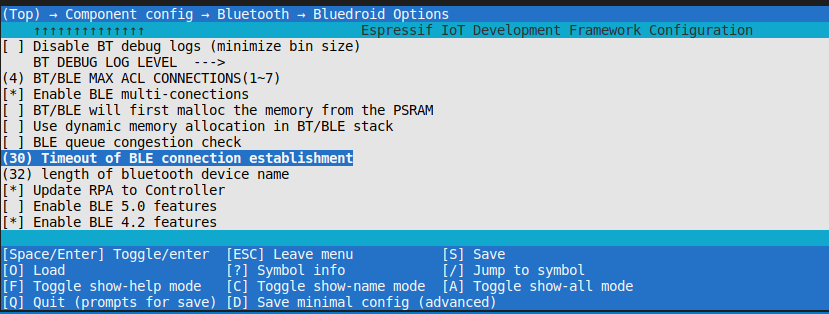

# ble_issuses

## 1.  esp_ble_gattc_open 连接超时

使用 gattc_client 示例，如果在扫描到目标设备并且使用 `esp_ble_gattc_open` 建立连接时，将`scan_result->scan_rst.bda` 换成其他无效设备地址，会有 30 秒的事件才会上来 

```shell
I (30505) GATTC_DEMO: ESP_GATTC_DISCONNECT_EVT, reason = 256
E (30515) GATTC_DEMO: open failed, status 133
```

这个 30 秒的事件可以在 menuconfig 中进行配置



这个宏 的作用时间是在`l2cble_init_direct_conn` 中

```c
BOOLEAN l2cble_init_direct_conn (tL2C_LCB *p_lcb)
{
	// ...
    uint32_t link_timeout = L2CAP_BLE_LINK_CONNECT_TOUT;
    if(GATTC_CONNECT_RETRY_COUNT) {
        if(!p_lcb->retry_create_con) {
            p_lcb->start_time_s = (esp_system_get_time()/1000);
        }
        uint32_t current_time = (esp_system_get_time()/1000);
        link_timeout = (L2CAP_BLE_LINK_CONNECT_TOUT*1000 - (current_time - p_lcb->start_time_s))/1000;

        if(link_timeout == 0 || link_timeout > L2CAP_BLE_LINK_CONNECT_TOUT) {
            link_timeout = L2CAP_BLE_LINK_CONNECT_TOUT;
        }
    }
    if (!p_lcb->is_aux) {
        if (!btsnd_hcic_ble_create_ll_conn (scan_int,/* UINT16 scan_int      */
                                            scan_win, /* UINT16 scan_win      */
                                            FALSE,                   /* UINT8 white_list     */
                                            peer_addr_type,          /* UINT8 addr_type_peer */
                                            peer_addr,               /* BD_ADDR bda_peer     */
                                            own_addr_type,         /* UINT8 addr_type_own  */
                                            (UINT16) ((p_dev_rec->conn_params.min_conn_int != BTM_BLE_CONN_PARAM_UNDEF) ?
                                                      p_dev_rec->conn_params.min_conn_int : BTM_BLE_CONN_INT_MIN_DEF),  /* UINT16 conn_int_min  */
                                            (UINT16) ((p_dev_rec->conn_params.max_conn_int != BTM_BLE_CONN_PARAM_UNDEF) ?
                                                      p_dev_rec->conn_params.max_conn_int : BTM_BLE_CONN_INT_MAX_DEF),  /* UINT16 conn_int_max  */
                                            (UINT16) ((p_dev_rec->conn_params.slave_latency != BTM_BLE_CONN_PARAM_UNDEF) ?
                                                      p_dev_rec->conn_params.slave_latency : BTM_BLE_CONN_SLAVE_LATENCY_DEF), /* UINT16 conn_latency  */
                                            (UINT16) ((p_dev_rec->conn_params.supervision_tout != BTM_BLE_CONN_PARAM_UNDEF) ?
                                                      p_dev_rec->conn_params.supervision_tout : BTM_BLE_CONN_TIMEOUT_DEF), /* conn_timeout */
                                            BLE_CE_LEN_MIN,                       /* UINT16 min_len       */
                                            BLE_CE_LEN_MIN)) {                    /* UINT16 max_len       */
                printf("-------3>\n");
            l2cu_release_lcb (p_lcb);
            L2CAP_TRACE_ERROR("initate direct connection fail, no resources");
            return (FALSE);
        } else {
                printf("-------4>\n");
            p_lcb->link_state = LST_CONNECTING;
            l2cb.is_ble_connecting = TRUE;
            memcpy (l2cb.ble_connecting_bda, p_lcb->remote_bd_addr, BD_ADDR_LEN);
            btu_start_timer (&p_lcb->timer_entry, BTU_TTYPE_L2CAP_LINK, link_timeout);
            btm_ble_set_conn_st (BLE_DIR_CONN);

            return (TRUE);
        }
    } 
    // ...
}
```

在上述 API 中开起了一个定时器 `btu_start_timer`,   定时时间就是 30s， 而 `btsnd_hcic_ble_create_ll_conn`  是发给 Controller 的连接参数配置，其中conn_timeout 参数是给定值 6s,  当连接成功时会返回 `ESP_GATTC_OPEN_EVT` 的 callback，如果对端未有响应，等到 30s 定时时间到时返回 open failed 的 `ESP_GATTC_OPEN_EVT` 事件

